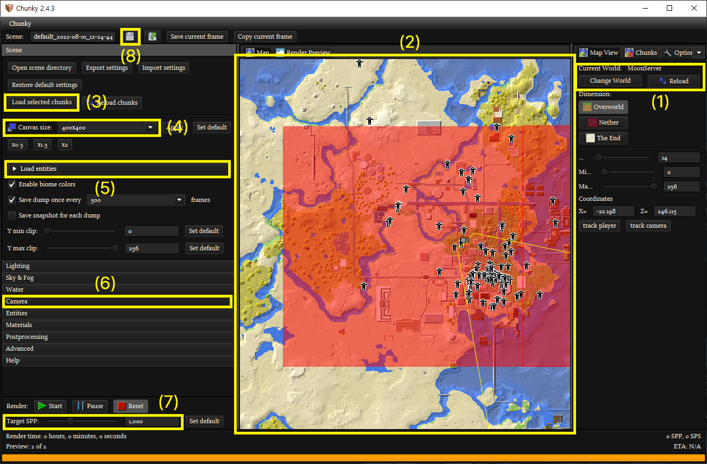

# renderlapse: Create timelapse video from Minecraft world backups

This program creates a timelapse video from your Minecraft world backups. It uses Chunky to render a screenshot of each of the worlds, and ffmpeg to concatenate screenshots into a video.

## Preparing World Backups

You should prepare backups in a same directory for a batch rendering. Each backup should be a *full* Minecraft world which can playable in Minecraft without any modification. If your world is separated into multiple dimensions (e.g. `world`, `world_nether`, `world_the_end`), you can take just one dimension you'd like to render.

Every backup should be nested in a folder named `world-yymmdd`!

The structure of the directory should be like this:
```
..
└ world-170101
  └ world
    └ level.dat
    └ ...
└ world-170205
└ world-170316
└ world-170409
└ world-170520
└ ...
```

## Preparing JSON file (requires Chunky)

You have to create a preset JSON scene file so that Chunky can reuse it to render multiple worlds with the same camera angle and settings.



1. Load one of your backup worlds.
2. Select chunks to render. **Be careful - Chunky throws an error when it tries to render chunks that are not generated. You need another scene with the same settings but less chunk range for older worlds that don't have enough chunks to render.**
3. Load selected chunks.
4. Canvas size. 1920 * 1080 is recommended.
5. Un-check all entities.
6. Set the camera. You can do this in Render Preview tab as well.
7. Set target SPP(Samples Per Pixel). 64 is recommended.
8. Save the scene.

## Rendering (requires Chunky & ffmpeg)

### Rendering frames

You need Chunky for this since it uses headless rendering mode of Chunky. To render frames, type

### Generating video

## Troubleshooting

### Chunky throws ```java.lang.NullPointerException: Cannot invoke "String.equals(Object)" because the return value of "se.llbit.chunky.world.Chunk.getVersion()" is null```  

This happens when Chunky tries to render chunks that are not yet generated. See (2) at **Preparing JSON file**.